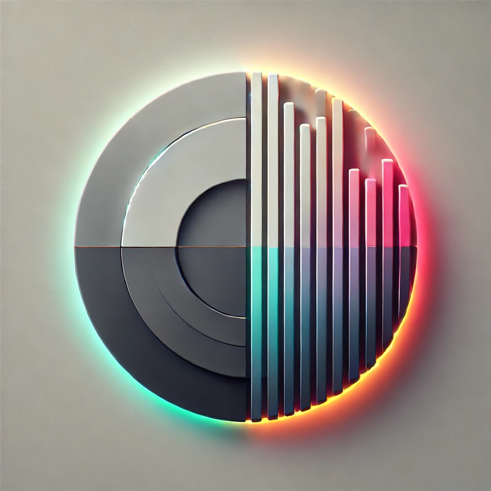

# colorPal

  
  
  
  
  


**colorPal** is a cutting-edge web application for creating stunning and highly customizable **data visualizations**. Designed with creativity and user experience at its core, colorPal transforms boring charts into visually appealing, artistic diagrams with unparalleled styling options.

---

## Features

### 🎨 **Dynamic Chart Customization**

- Supports popular chart types:
  - **Pie Chart** and **Donut Chart**
  - **Bar Chart** and **Line Chart**
  - **Radar Chart** and **Polar Chart**
- Fully configurable **8 input fields**: Add names, values, and choose custom colors or gradients for each data segment.

### ✨ **Advanced Styling Options**

- Add artistic depth and flair with:
  - **Inner/Outer Shadows** for a sense of dimension.
  - **Inner/Outer Glows** for vibrant highlighting.
  - **Smooth Gradients** for modern transitions.
- Customize **font size** and **font colors** for titles and legends.

### 📊 **Dynamic Layouts**

- Switch between **Vertical** and **Horizontal** layouts seamlessly.
- Align charts and legends for optimal visual balance.

### 🔄 **Real-Time Interactivity**

- Instant preview: All changes are rendered in **real time**.
- **Randomize** button: Automatically generate colors and values for inspiration.

### 📥 **JSON Import/Export**

- Import data in a structured JSON format to prefill input fields.
- Export your configuration for reuse or further editing.

### 🖼️ **High-Quality Export**

- Export charts as:
  - **SVG**: For scalable, high-resolution graphics.
  - **PNG**: For seamless integration into presentations and reports.
  - **Clipboard**: Copy your chart directly for quick pasting.

### 🌙 **Light and Dark Modes**

- Choose between **Light** and **Dark themes** to match your design workflow.

---

## Installation

1. **Clone the Repository**:

   ```bash
   git clone https://github.com/yourusername/colorPal.git
   cd colorPal
   ```

2. **Install Dependencies**:
   Ensure that Node.js is installed. Run:

   ```bash
   npm install
   ```

3. **Start the Development Server**:

   ```bash
   npm start
   ```

4. Open your browser and visit `http://localhost:3000` to access colorPal.

---

## Usage

### Creating a Chart

1. **Select a Chart Type**: Use the dropdown to choose from available chart types (Pie, Donut, Bar, etc.).
2. **Configure Inputs**:
   - Fill out the **name**, **value**, and select a **color** or **gradient** for each segment.
3. **Style Your Chart**:
   - Apply **shadows**, **glows**, and other effects using the control panel.
   - Customize the font and layout for a professional finish.
4. **Preview in Real-Time**: All changes update instantly in the preview area.
5. **Export the Chart**:
   - Save as **SVG**, **PNG**, or copy directly to your clipboard.

---

## Export Example

Here’s an example of a beautifully styled Pie Chart created with colorPal:


---

## Development

Interested in contributing or customizing colorPal? Here’s how to set up a development environment:

1. **Clone the Repository**:

   ```bash
   git clone https://github.com/yourusername/colorPal.git
   cd colorPal
   ```

2. **Install Dependencies**:

   ```bash
   npm install
   ```

3. **Run the Application**:

   ```bash
   npm start
   ```

4. **Build for Production**:
   ```bash
   npm run build
   ```

This will create an optimized build in the `build/` directory.

---

## Key Technologies

- **React**: For building the dynamic and responsive UI.
- **Styled Components**: For modular and customizable styling.
- **html2canvas**: For seamless chart exports.
- **React Context API**: For managing state globally.

---

## License

colorPal is licensed under the MIT License. See the [LICENSE](./LICENSE) file for more details.

---

## AI-Aided Development

colorPal is an example of how thoughtful design and AI-driven best practices can bring creative ideas to life. From modular components to real-time updates, colorPal is built for both developers and designers to produce exceptional visualizations.

---

## Tags

- **Data Visualization**
- **Chart Customization**
- **Real-Time Preview**
- **React Application**
- **Dynamic Styling**
- **SVG/PNG Export**
- **Creative Design Tools**
- **Light/Dark Mode**
- **Modern UI/UX**
- **Open Source**
- **MIT License**

---

With **colorPal**, you can transform simple data into artistic masterpieces effortlessly. Bring your charts to life and make your visualizations stand out! 🚀

---

**Feedback & Contributions**: If you encounter any issues or have feature requests, feel free to [open an issue](https://github.com/yourusername/colorPal/issues) or contribute directly to the project!
